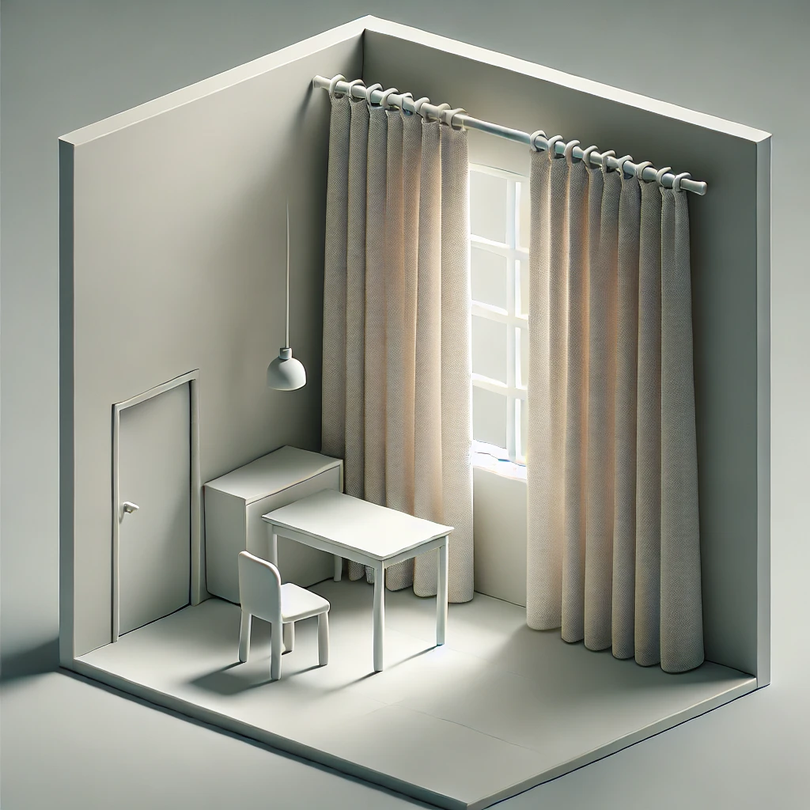
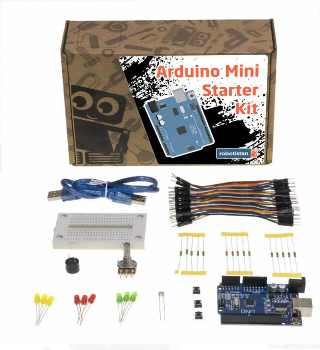
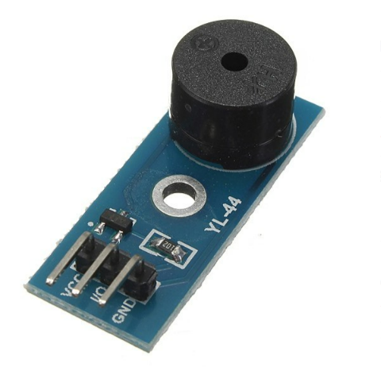
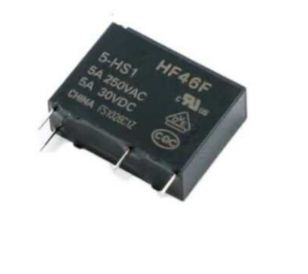
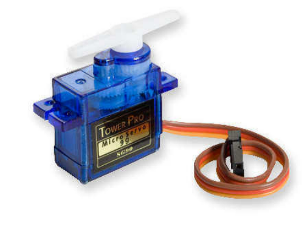
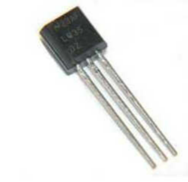

# Akilli Perde Kontrol Sistemi

## Proje Konusu
Bu proje, iç mekanlarda konforu artırmak ve enerji verimliliğini sağlamak amacıyla, ışık ve sıcaklık sensörleri kullanarak otomatik olarak açılıp kapanabilen bir perde kontrol sistemini geliştirmeyi amaçlamaktadır.

## Proje Kısa Özeti
Günümüzde manuel perde kontrolü, kullanıcılar için zahmetli olabilmekte ve enerji verimliliği açısından dezavantaj yaratmaktadır. Bu proje kapsamında geliştirilecek sistem, ortamın ışık ve sıcaklık değerlerini ölçerek perdeyi otomatik olarak açıp kapatacaktır. Sistem, Arduino mikrodenetleyicisi, servo motor, LDR ışık sensörü ve LM35 sıcaklık sensörünü kullanarak çalışacaktır. Geliştirme sürecinde, sensörlerden gelen verileri işleyen bir algoritma yazılacak ve sistem test edilerek optimize edilecektir. Opsiyonel olarak, mobil uygulama ile manuel kontrol özelliği de eklenebilir.

## Proje Gereksinimleri
Projenin çalıştırılabilmesi için aşağıdaki donanım ve yazılım bileşenleri gereklidir:

### Donanım:
- Arduino UNO
- SG90 veya MG995 Servo Motor
- LDR (Işık Sensörü)
- LM35 (Sıcaklık Sensörü)
- Potansiyometre
- Röle Modülü
- Jumper Kablolar
- Breadboard
- Harici Güç Kaynağı
- Buzzer (Opsiyonel)

### Yazılım:
- Arduino IDE
- C++ (Arduino kodlaması için)

**Not:** Gerekli tüm donanımlar [Robotistan](https://www.robotistan.com/) üzerinden temin edilebilir.

## Projeyi Çalıştırma
1. **Gerekli Donanımı Bağlayın:**
   - Arduino UNO'ya sensörleri ve motoru bağlayın.
   - LDR sensörünü ve sıcaklık sensörünü uygun pinlere yerleştirin.
   - Servo motoru röle modülü üzerinden bağlayın.

2. **Arduino IDE'yi Kurun:**
   - Arduino IDE'yi [buradan](https://www.arduino.cc/en/software) indirin ve yükleyin.

3. **Kodları Yükleyin:**
   - `akilli_perde_kontrol.ino` dosyasını Arduino IDE'ye açın.
   - Gerekli kütüphaneleri yükleyin (`DHT` ve `Servo` kütüphaneleri gereklidir).
   - Arduino'yu bilgisayara bağlayarak kodu yükleyin.

4. **Sistemi Çalıştırın:**
   - Sensörlerden veri alarak servo motorun perdeyi açıp kapattığını test edin.
   - Çeşitli ışık ve sıcaklık seviyelerinde sistemi test ederek optimizasyon yapın.

## Proje Lisans Bilgileri
Bu proje MIT Lisansı altında lisanslanmıştır. Detaylı bilgi için `LICENSE` dosyasına bakabilirsiniz.

## Proje Anahtar Kelimeleri
- IoT
- Arduino
- Akıllı Ev
- Otomasyon
- Sensör Teknolojisi
- Enerji Verimliliği

## Görseller

## Örnek Proje Maketi

## Kullanılacak Malzemeler
### Arduino Set

### Buzzer

### Röle

### Servo Motor

### Sıcaklık Sensörü

